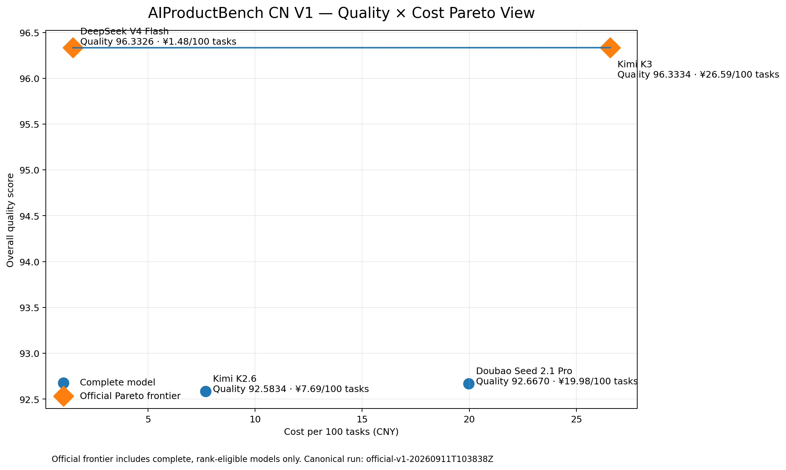
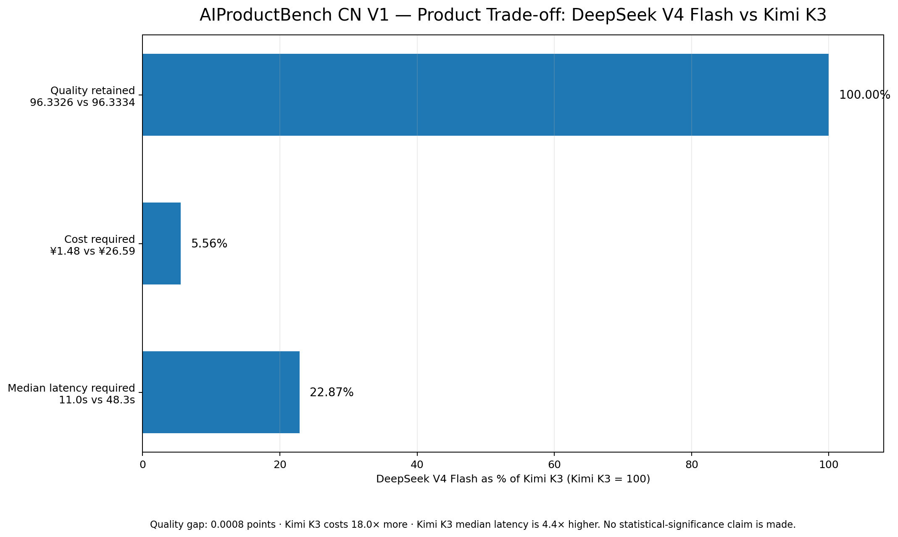

# AIProductBench CN

### 面向 AI 产品团队的中文大模型选型 Benchmark

**Practical Chinese LLM Model Selection Benchmark for AI Product Teams**

**[English](./README.md) | 简体中文**

**10 个模型 · 6 家 Provider · 50 个真实产品任务 · 1,490 个正式评测单元**

**质量 × 成本 × 延迟 · 混合评测 · 跨模型家族双 Judge · Pareto 分析**

> 对于一个具体的 AI 产品场景，在质量目标、成本预算和延迟要求下，
> 我们到底应该选择哪个模型？

AIProductBench CN 是一个面向真实 AI 产品决策的大模型评测与选型系统。

它并不是为了回答：

> “哪个大模型绝对最强？”

而是希望回答更接近产品实际的问题：

> **在具体业务任务里，模型质量、成本、延迟、约束遵循能力和任务适配度之间，
> 应该如何做取舍？**

最终产物不是一个单一排行榜，而是一套面向产品决策的模型选择框架。

**V1 状态：已发布**

Canonical Run：

`official-v1-20260911T103838Z`

[**V1 结果**](release/v1/README.md) ·
[**评测方法**](docs/METHODOLOGY_V1.md) ·
[**Case 设计标准**](docs/CASE_DESIGN_STANDARD_V1.md) ·
[**Run Manifest**](release/v1/run_manifest.json)

---

## V1 核心结论

| | 结果 |
| --- | --- |
| **最高实测综合质量** | **Kimi K3 — 96.3334** |
| **接近同等质量下，成本 / 延迟权衡最突出** | **DeepSeek V4 Flash — 96.3326** |
| **DeepSeek V4 Flash 成本** | **¥1.48 / 100 个任务** |
| **DeepSeek V4 Flash 候选模型中位延迟** | **11.0s** |
| **官方 Pareto 前沿** | **Kimi K3 + DeepSeek V4 Flash** |
| **正式进入排名的模型** | **4 / 10** |



*4 个 COMPLETE、满足排名资格的 V1 模型的官方质量 × 成本 Pareto 视图。*

### 真正的产品结论

Kimi K3 在 V1 中取得了最高的实测综合质量：

**96.3334**

DeepSeek V4 Flash 的综合质量为：

**96.3326**

两者仅相差：

**0.0008 分**

但在本次 Benchmark 中，DeepSeek V4 Flash：

- 成本约低 **18 倍**
- 候选模型中位延迟约低 **4 倍**

需要特别强调：

这 **0.0008 分的差距不能被解释为统计学显著差异**。

V1 没有进行重复采样，也没有进行显著性检验。

因此，真正有价值的结论并不是：

> “模型 A 排名第一。”

而是：

> **当模型质量已经非常接近时，成本和延迟可能会彻底改变最终的产品选型结果。**

如果业务目标是尽可能追求最高质量，那么 Kimi K3 是 V1 中实测最强的选择。

如果业务能够接受近似同等的实测质量，同时非常关注成本和响应速度，
那么 DeepSeek V4 Flash 在官方 Pareto 前沿上体现出了更强的产品综合性价比。



*在本次 Benchmark 中，DeepSeek V4 Flash 保留了几乎相同的实测质量，
但只需要 Kimi K3 一小部分的成本和候选模型中位延迟。*

---

## V1 一览

| Benchmark 范围 | 评测规模 |
| --- | --- |
| **10 个候选模型** | **500 次 Candidate Evaluation** |
| **6 家 Provider 集成** | **990 次跨模型家族 Judge Evaluation** |
| **50 个冻结生产任务** | **1,490 个正式评测单元** |
| **5 类工作负载** | **¥109.73 Canonical API 总支出** |

V1 基于真实付费 API 执行。

`execution_complete = true`

但与此同时：

`all_models_complete = false`

按照冻结后的严格完整性规则：

**10 个模型中有 4 个满足 COMPLETE 条件并进入正式排名。**

另外 6 个模型保留其真实运行和失败诊断证据，但不会被放入正式排行榜或
官方 Pareto 前沿。

---

## 为什么要做这个 Benchmark

公开的大模型排行榜可以帮助我们理解模型的通用能力。

但真实的 AI 产品团队通常面对的并不是：

> 哪个模型 benchmark 分最高？

而是：

> **这个具体产品，到底应该上线哪个模型？**

真实产品中的模型选型往往需要同时考虑：

- 输出质量
- 指令与约束遵循能力
- 推理成本
- 响应延迟
- 工作负载类型
- 运行稳定性
- 可以接受的质量 / 成本交换关系

因此，质量最高的模型，并不一定是最合适的产品选择。

AIProductBench CN 将整个选型过程组织为：

**真实产品任务 → 候选模型 → Deterministic Checks → 双 LLM Judge → 质量 / 成本 / 延迟 → Pareto 分析 → 产品决策**

---

## Benchmark 任务设计

V1 使用 **50 个冻结后的真实产品任务**。

共覆盖 5 类工作负载，每类 10 个 Case：

| # | 工作负载 | Key |
| --- | --- | --- |
| 1 | 指令与约束遵循 | `instruction_constraint_following` |
| 2 | 结构化信息分析 | `structured_information_analysis` |
| 3 | 产品推理与决策 | `product_reasoning_decision` |
| 4 | 中文商业沟通 | `chinese_business_communication` |
| 5 | Agent Workflow Planning | `agent_workflow_planning` |

这些任务主要模拟真实 AI 产品工作，而不是传统学术知识测试。

完整方法论：

[docs/METHODOLOGY_V1.md](docs/METHODOLOGY_V1.md)

Case 设计规范：

[docs/CASE_DESIGN_STANDARD_V1.md](docs/CASE_DESIGN_STANDARD_V1.md)

50 个 Case 的覆盖矩阵：

[docs/CASE_MATRIX_V1.md](docs/CASE_MATRIX_V1.md)

---

## 评测框架

AIProductBench CN 使用混合评测架构。

### 1. Deterministic Evaluation

对于能够客观机器校验的要求，使用确定性检查。

V1 共实现：

**21 类 Deterministic Check**

例如：

- 输出结构
- 字段完整性
- 长度约束
- 数值约束
- 格式要求
- 特定内容规则

约束通过情况独立记录为：

`constraint_pass_rate`

它不会被隐藏在 LLM Judge 分数中。

---

### 2. 跨模型家族双 LLM Judge

每一个 Candidate Response 都由来自其他模型家族的两个 Judge 独立评估。

Judge 维度包括：

- **Task Completion**
- **Reasoning Quality**
- **Instruction Following**

Canonical 评测设计中不使用同模型家族替代 Judge。

这样可以降低单一 Judge 模型对结果的影响，但不能完全消除 Judge Bias。

双 Judge 分歧数据公开在：

[release/v1/judge_disagreement.json](release/v1/judge_disagreement.json)

---

### 3. 成本评测

Candidate 推理成本和 Judge 评测成本严格分开记录。

两者不会被混入同一个“模型成本”指标。

系统保留 Provider 原始：

- 定价
- 计价单位
- 币种

面向用户展示时，再通过明确的时间快照和汇率快照统一换算为 RMB / CNY。

---

### 4. 延迟评测

Candidate Latency 与 Judge Latency 同样严格分离。

产品选型中的延迟指标只关注候选模型自身的推理延迟，
不会把整个 Benchmark 系统的评测耗时混入产品侧指标。

---

### 5. Pareto 分析

AIProductBench CN 不试图通过一个综合分数宣布“唯一冠军”。

V1 分别计算：

- **质量 × 成本**
- **质量 × 成本 × 延迟**

两个官方 Pareto Frontier。

如果不存在另一个符合资格的模型能够在所有比较维度上同时优于某个模型，
那么该模型即位于 Pareto 前沿。

---

## 模型池

V1 共评测 10 个候选模型，覆盖 6 家 Provider 集成。

模型池由配置文件驱动：

[data/model_registry_snapshot_v1.json](data/model_registry_snapshot_v1.json)

| Provider | 候选模型 |
| --- | --- |
| Qwen | `qwen3.8-max`, `qwen3.8-flash` |
| DeepSeek | `deepseek-v4-pro`, `deepseek-v4-flash` |
| Kimi | `kimi-k3`, `kimi-k2.6` |
| MiniMax | `MiniMax-M3` |
| GLM | `glm-5.3`, `glm-5.3-flash` |
| Doubao | `doubao-seed-2-1-pro-260628` |

Benchmark 核心逻辑不会根据某一个具体模型名或 Provider 名硬编码特殊分支。

---

## V1 官方排名

只有满足冻结后严格完整性规则的模型才进入正式排名。

| 排名 | 模型 | Overall Quality | 成本 / 100 Tasks | Candidate Median Latency | Constraint Pass Rate | Pareto |
| --- | --- | ---: | ---: | ---: | ---: | --- |
| 1 | Kimi K3 (`kimi-k3`) | **96.3334** | ¥26.59 | 48.3s | 0.9953 | **Yes** |
| 2 | DeepSeek V4 Flash (`deepseek-v4-flash`) | **96.3326** | ¥1.48 | 11.0s | 0.9858 | **Yes** |
| 3 | Doubao Seed 2.1 Pro (`doubao-seed-2-1-pro-260628`) | 92.667 | ¥19.98 | 102.1s | 0.9858 | — |
| 4 | Kimi K2.6 (`kimi-k2.6`) | 92.583 | ¥7.69 | 50.1s | 0.9858 | — |

上表为方便阅读的四舍五入展示值。

完整精确数据位于：

- [release/v1/leaderboard.csv](release/v1/leaderboard.csv)
- [release/v1/leaderboard.json](release/v1/leaderboard.json)

例如：

- DeepSeek V4 Flash：`¥1.4783062 / 100 tasks`
- Kimi K3：`¥26.58924966 / 100 tasks`

---

## 为什么只有 4 / 10 个模型进入正式排名

V1 使用严格完整性规则。

一个模型要进入官方排名，需要完成：

- 全部 50 个 Candidate Case
- 每个必要 Candidate Response 对应的两个有效跨模型家族 Judge Verdict

以下情况都可能导致模型被标记为：

**INCOMPLETE**

例如：

- Candidate 生成失败
- Transport Failure
- Required Judge 输出无效
- Runtime Envelope Exhaustion

V1 中有 6 个逻辑模型 Slot 未满足完整性条件：

- `deepseek_flagship`
- `qwen_flagship`
- `qwen_value`
- `minimax_flagship`
- `glm_flagship`
- `glm_value`

因此，它们不会进入：

- 官方排行榜
- 官方质量对比
- 官方 Pareto Frontier

但这些失败结果并没有被删除。

它们仍然作为真实运行诊断证据保留。

需要注意的是：

**Benchmark 执行完成，不等于所有模型都完整。**

本次正式运行：

`execution_complete = true`

因为所有计划中的付费评测单元都已经被尝试并持久化。

但：

`all_models_complete = false`

因为并不是所有模型都满足进入排名的完整性合同。

详细信息：

- [release/v1/run_manifest.json](release/v1/run_manifest.json)
- [docs/METHODOLOGY_V1.md](docs/METHODOLOGY_V1.md)

---

## Pareto Frontier

| Pareto 分析 | 官方模型 |
| --- | --- |
| **质量 × 成本** | Kimi K3, DeepSeek V4 Flash |
| **质量 × 成本 × 延迟** | Kimi K3, DeepSeek V4 Flash |

INCOMPLETE 模型不会被放入官方 Pareto Frontier。

Pareto 分析的目标并不是再造一个排行榜。

真正需要回答的问题是：

> **我们为了更高的质量，到底付出了多少额外成本和延迟？**

---

## 可复现性与 Provenance

Canonical V1 结果绑定了固定的：

- 数据集
- 模型 Registry
- Pricing Snapshot
- FX Snapshot
- Runtime Configuration
- Execution Commit

| 字段 | Canonical V1 |
| --- | --- |
| Canonical Run | `official-v1-20260911T103838Z` |
| Execution Commit | `f3225f51824f4e3c047b2df3c15092a803231291` |
| Runtime Baseline | `e10ceb0aa89483050ec0b09eb96e7d16c37e4e09` |
| Dataset Semantic Manifest | `6b450383e528a5a0a6b813112f96182a3625c04c948839fc551c8ded63da513c` |
| Registry | `v1-registry-2026-09-11.3` |
| Registry SHA | `259b02adb05f73ab2d800c8f41d9b2608b8eddb17ae97e9d3f31ecff79409eab` |
| Pricing | `v1-pricing-2026-09-11.1` |
| Pricing SHA | `9f7af42243e5e0b78b1776934de5483f0e3e650765a19dd929e78af10aa15c42` |
| FX | `ecb-2026-09-10-usd-cny` |
| USD / CNY | `6.706267217630854` |

### Canonical Runtime Envelope

| 配置 | V1 值 |
| --- | --- |
| Candidate Generation Ceiling | 32,768 tokens |
| Judge Generation Ceiling | 16,384 tokens |
| Client Timeout | 600 seconds |
| Global Provider Concurrency | 6 |
| Default Per-provider Concurrency | 2 |
| Hard Cost Ceiling | ¥150.00 |

正式运行支持 Checkpoint 与 Resume。

已经完成的付费调用会被保留，Bounded Retry 只针对未完成任务，
避免无意义地重复已经完成的付费请求。

---

## V1 公开结果文件

Canonical V1 结果位于：

`release/v1/`

主要产物：

| 文件 | 用途 |
| --- | --- |
| [leaderboard.html](release/v1/leaderboard.html) | 独立结果展示 |
| [leaderboard.csv](release/v1/leaderboard.csv) | 表格型 Benchmark 结果 |
| [leaderboard.json](release/v1/leaderboard.json) | 结构化排行榜数据 |
| [pareto.json](release/v1/pareto.json) | Pareto Frontier |
| [cost_summary.json](release/v1/cost_summary.json) | Candidate 成本汇总 |
| [latency_summary.json](release/v1/latency_summary.json) | Candidate 延迟汇总 |
| [judge_disagreement.json](release/v1/judge_disagreement.json) | 双 Judge 分歧分析 |
| [sample_results.json](release/v1/sample_results.json) | 公开样例结果 |
| [run_manifest.json](release/v1/run_manifest.json) | Canonical Run 与 Provenance |

已发布的 V1 结果应被视为不可静默修改的历史证据。

未来如果修改了：

- 模型版本
- 数据集
- 定价
- Provider 配置
- 评测方法
- Runtime Envelope
- Evaluation Logic

应该创建新的 Benchmark 版本，而不是直接覆盖 V1。

---

## 局限性

AIProductBench CN V1 **不评测**：

- 多模态 / Vision
- Coding
- RAG
- 实时 Web Search
- 真实 Tool Execution
- Multi-Agent Execution
- Fine-tuning
- Production Routing

同时还存在以下限制：

- 10 个模型、50 个任务属于实用型产品 Benchmark，而不是科学上全面的大规模 Benchmark。
- V1 没有进行重复采样和统计显著性检验。
- 跨模型家族双 Judge 可以降低单一 Judge Family 的影响，但不能完全消除 Judge Bias。
- **Human Calibration Sample 已准备，但人工 Review 尚未完成。**
- 因此 V1 **不是 Human-calibrated Benchmark**。
- Pricing 使用固定日期快照，并非 Provider 实时 Billing Feed。
- Latency 会受到 Provider 负载、地区和网络路径影响。

---

## 项目结构

```text
.
├── run_benchmark.py        # Benchmark 主 CLI
├── run_official.py         # Canonical 正式执行支持
├── run_probe.py            # Provider / Runtime 定向 Probe
├── run_smoke.py            # 受控 Live Smoke Validation
├── data/                   # Cases、Model Registry、Pricing 和 FX Snapshot
├── docs/                   # 产品定义、方法论、决策记录和 Handoff
├── src/                    # Benchmark 执行与分析模块
├── tests/                  # unittest 测试
└── release/v1/             # Canonical V1 公开结果
```

### 关键文档

| 文档 | 内容 |
| --- | --- |
| [PRODUCT_SPEC_V1](docs/PRODUCT_SPEC_V1.md) | V1 产品范围与边界 |
| [METHODOLOGY_V1](docs/METHODOLOGY_V1.md) | 评测方法 |
| [ARCHITECTURE](docs/ARCHITECTURE.md) | Pipeline、模块与数据流 |
| [CASE_DESIGN_STANDARD_V1](docs/CASE_DESIGN_STANDARD_V1.md) | Production Case 设计标准 |
| [CASE_MATRIX_V1](docs/CASE_MATRIX_V1.md) | 50 个任务覆盖设计 |
| [DATASET_QA_V1](docs/DATASET_QA_V1.md) | 数据集 QA |
| [DATASET_FREEZE_V1](docs/DATASET_FREEZE_V1.md) | 冻结数据集 Manifest |
| [DECISIONS](docs/DECISIONS.md) | 产品与工程决策日志 |
| [HANDOFF](docs/HANDOFF.md) | 当前发布后的项目状态 |

---

## 本地运行

需要：

**Python 3.10+**

当前唯一外部 Runtime Dependency：

`requests`

安装依赖：

```bash
pip install -r requirements.txt
```

执行离线验证：

```bash
python3 run_benchmark.py --validate-only
python3 run_benchmark.py --validate-only --production-cases
python3 run_benchmark.py --dry-run
python3 -m unittest discover -s tests -v
```

以上操作：

**不会产生网络调用。**

`--dry-run` 只会生成明确标记为 Synthetic 的模拟结果，
并且不会覆盖已经发布的 V1 数据。

### 关于付费正式运行

真实 Provider Run：

- 需要环境变量中的 API Credential
- 会产生真实 API 成本

Canonical V1 Paid Run 已经完成。

不要直接再次执行：

`python3 run_benchmark.py --confirm`

除非同时满足：

- 明确的新一轮 Paid Run 授权
- 新的 Cost Projection
- 新的 Versioned Execution Plan

---

## 这个项目证明了什么

AIProductBench CN 的目标不是“做一个排行榜”。

它更接近一套完整的 AI 产品选型系统。

项目完整覆盖：

**问题定义 → Benchmark 设计 → 数据集治理 → Evaluation Pipeline → 模型接入 → 成本 / 延迟测量 → 结果分析 → 产品决策**

从 AI 产品经理的角度，这个项目真正希望证明的并不是：

> “我会调用多个模型 API。”

而是：

> **我能够把模型能力转化成一套可复现、可审计、可以支撑真实产品选型的决策系统。**

---

## License

MIT — see [LICENSE](LICENSE).
